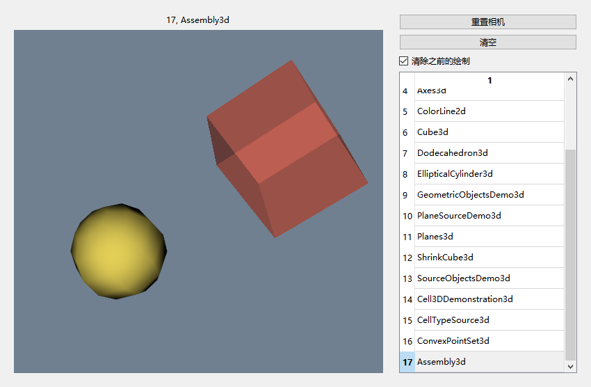

# Tip

- [1, ExampleCells2d](#1-examplecells2d)
- [2, Cylinder3d](#2-cylinder3d)
- [3, SimpleOperations](#3-simpleoperations)
- [4, Axes3d](#4-axes3d)
- [5, ColorLine2d](#5-colorline2d)
- [6, Cube3d](#6-cube3d)
- [7, Dodecahedron3d](#7-dodecahedron3d)
- [8, EllipticalCylinder3d](#8-ellipticalcylinder3d)
- [9, GeometricObjectsDemo3d](#9-geometricobjectsdemo3d)
- [10, PlaneSourceDemo3d](#10-planesourcedemo3d)
- [11, Planes3d](#11-planes3d)
- [12, ShrinkCube3d](#12-shrinkcube3d)
- [13, SourceObjectsDemo3d](#13-sourceobjectsdemo3d)
- [14, Cell3DDemonstration3d](#14-cell3ddemonstration3d)
- [15, CellTypeSource3d](#15-celltypesource3d)
- [16, ConvexPointSet3d](#16-convexpointset3d)
- [17, Assembly3d](#17-assembly3d)
- [18, LinearCellsDemo3d](#18-linearcellsdemo3d)
- [19, ConesOnSphere3d](#19-conesonsphere3d)
- [20, EarthSource3d](#20-earthsource3d)
- [21, Frustum3d](#21-frustum3d)
- [22, OrientedArrow3d](#22-orientedarrow3d)
- [23, OrientedCylinder3d](#23-orientedcylinder3d)
- [24, Plane2d](#24-plane2d)
- [25, PlatonicSolids3d](#25-platonicsolids3d)

[26-50](./readme26-50.md)

Markdown All in One: Create Table of Contents, `vscode`生成`github`可读取的目录

# 1, ExampleCells2d

[回到顶部](#tip)

显示10*10的单元格


# 2, Cylinder3d

[回到顶部](#tip)

 cylinder->SetResolution(6);

根据resolution绘制多个顶点


# 3, SimpleOperations

[回到顶部](#tip)

// new version


// old version

一些计算,没有图像,在输出查看,具体看代码


# 4, Axes3d

[回到顶部](#tip)


# 5, ColorLine2d

[回到顶部](#tip)


# 6, Cube3d

[回到顶部](#tip)

把sample op移到第一个了,免得不小心点到

两种形式生成cube,一种自己给点给面(polydata),另一种是直接用自带的source(vtkCubeSource)


# 7, Dodecahedron3d

[回到顶部](#tip)


# 8, EllipticalCylinder3d

[回到顶部](#tip)


添加了箭头


# 9, GeometricObjectsDemo3d

[回到顶部](#tip)


# 10, PlaneSourceDemo3d

[回到顶部](#tip)


# 11, Planes3d

[回到顶部](#tip)


# 12, ShrinkCube3d

[回到顶部](#tip)


# 13, SourceObjectsDemo3d

[回到顶部](#tip)


# 14, Cell3DDemonstration3d

[回到顶部](#tip)

[learn](./examples/readme_unstructuredGrid.md)


# 15, CellTypeSource3d

[回到顶部](#tip)


# 16, ConvexPointSet3d

[回到顶部](#tip)

[learn](./examples/readme_16vtkGlyph3DMapper.md)


# 17, Assembly3d

[回到顶部](#tip)



# 18, LinearCellsDemo3d

[回到顶部](#tip)


# 19, ConesOnSphere3d

[回到顶部](#tip)


# 20, EarthSource3d

[回到顶部](#tip)


# 21, Frustum3d

[回到顶部](#tip)


# 22, OrientedArrow3d

[回到顶部](#tip)

```c++
#if 0
    // no new data created
    mapper->SetInputConnection(arrow_source->GetOutputPort());
    actor->SetUserTransform(transfrom);
#else
    // create new polydata
    auto transform_pd = vtkSmartPointer<vtkTransformPolyDataFilter>::New();
    transform_pd->SetTransform(transfrom);
    transform_pd->SetInputConnection(arrow_source->GetOutputPort());
    mapper->SetInputConnection(transform_pd->GetOutputPort());
#endif
```


# 23, OrientedCylinder3d

[回到顶部](#tip)

```c++
// 只有heigth方向(自身坐标系y方向)scale 长度到length 
vtkMath::Subtract(end_p, start_p, normal_y);
// 平移到中点
matrix->SetElement(0, 3, (start_p[0] + end_p[0]) / 2);
```


# 24, Plane2d

[回到顶部](#tip)


# 25, PlatonicSolids3d

[回到顶部](#tip)


