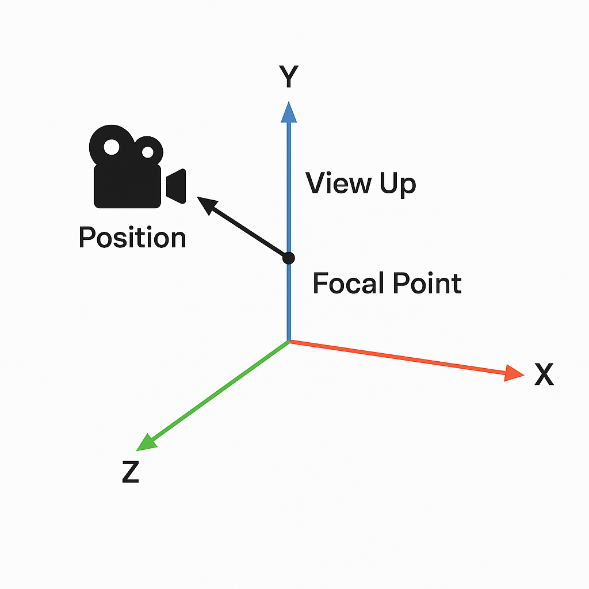

[TOC]

# [例子](./examples/readme_list.md)

# 如何学习

------

## 🧭 **一、VTK 学习的两个重点方向**

### ✅ 1. **理解 VTK 的绘制流程（核心逻辑）**

无论是画点、线、面、模型、图像、体绘制，**核心逻辑永远是这套流程**：

```text
数据源（Source 或你手动构建） → 数据处理（Filter，可选） → 映射器（Mapper） → 演员（Actor） → 场景（Renderer） → 窗口（RenderWindow）
```

------

### ✅ 2. **掌握一批常用类（80%的任务只用20%的类）**

| 功能               | 常用类名                                                     |
| ------------------ | ------------------------------------------------------------ |
| 点/线/面数据结构   | `vtkPoints`, `vtkCellArray`, `vtkPolyData`                   |
| 数据源（几何体）   | `vtkSphereSource`, `vtkCubeSource`, `vtkPlaneSource` 等      |
| 图像数据           | `vtkImageData`, `vtkPNGReader`, `vtkImageViewer2`            |
| 映射器             | `vtkPolyDataMapper`, `vtkImageMapper` 等                     |
| 演员（放到场景中） | `vtkActor`, `vtkActor2D`                                     |
| 场景与渲染         | `vtkRenderer`, `vtkRenderWindow`, `vtkRenderWindowInteractor` |
| 相机控制           | `vtkCamera`                                                  |
| 用户交互           | `vtkInteractorStyleTrackballCamera`, `vtkInteractorStyleImage` 等 |
| 轴/标注/坐标系     | `vtkAxesActor`, `vtkAxisActor2D`, `vtkTextActor`             |

------

## 📚 **二、学习路径建议（推荐步骤）**

### Step 1️⃣：先掌握基本结构

- 画简单几何体（比如正方体、球体）——熟悉 `Source → Mapper → Actor`。
- 手动构造点线面（如你现在做的 grid 表格）——掌握 `vtkPoints`, `vtkCellArray` 等。

### Step 2️⃣：探索 2D / 3D 特性

- Actor vs Actor2D 区别
- 相机设置、投影方式
- 渲染坐标系与屏幕坐标系差别

### Step 3️⃣：尝试交互和事件

- 鼠标事件绑定
- 切换交互器
- 实现自定义行为（如拖动点、框选）

### Step 4️⃣：图像与高级功能（后期）

- 图像渲染：`vtkImageData`, `vtkImageViewer2`
- 体绘制（Volume Rendering）：医学图像可视化
- 数据读取（如 VTK 文件）

------

## 🧠 总结：怎么学 VTK 才高效？

| 方法                | 建议                                                        |
| ------------------- | ----------------------------------------------------------- |
| 掌握核心流程        | Source → Mapper → Actor → Renderer                          |
| 精学常用类          | 不必全部记住，只需理解常用组件如何拼装即可                  |
| 以项目/练习驱动学习 | 每次做一个小功能，比如画个网格、画个图像、加个交互          |
| 看官方例子          | VTK 官网有大量例子：https://kitware.github.io/vtk-examples/ |
| 问问题 + 改代码     | 就像你现在这样练习 + 理解比死记硬背强得多                   |

# 重置相机

```c++
void Func1::reset_camera()
{
    auto camera = m_render->GetActiveCamera();
    camera->SetPosition(0, 0, 600);
    camera->SetViewUp(0, 1, 0);
    camera->SetFocalPoint(0, 0, 0);
    m_render->ResetCamera();  
}
//相机站在 Z = 600 的位置（上方），
//眼睛往下看着原点 (0, 0, 0)，
//视线方向是朝负 Z 轴，
//图像中心是原点。
```

`SetPosition` 就是你站在哪里。

`SetFocalPoint` 是你在看哪儿。

`SetViewUp` 是你头顶朝哪个方向（决定图像的“旋转方向”）。

下面相机的位置应该在z轴正半轴上,看向焦点

