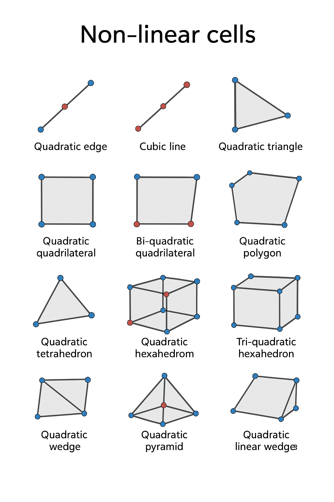

# **VTK 非线性单元（Non-Linear Cell）** 

------

## 1. vtkNonLinearCell 是什么

在 VTK 的单元体系里，单元基类有两条大分支：

- **vtkCell** → 基础单元（线、三角形、四面体、六面体等）
- **vtkNonLinearCell** → 高阶单元（边/面/体不是直的，可以弯曲）

区别：

- **线性单元（Linear Cell）**：只用顶点（corner nodes）定义几何，边和面自动是直的/平的。
- **非线性单元（NonLinear Cell）**：除了角点，还会加 **中间节点（mid-edge, mid-face, mid-volume points）**，几何形状通过插值生成，可以是曲线或曲面。

作用：

- 让曲边几何（比如圆柱、球面）在网格划分时更精确
- 提高有限元计算的精度（尤其是二阶或更高阶 FEM）

------

## 2. 你代码里的这些类

我帮你按类型简单列一下（括号里是阶次和形状）：

### **一维单元**

- **vtkQuadraticEdge**（二次边）：1D，两个端点 + 1 个中点 → 弯曲的边
- **vtkCubicLine**（三次线）：1D，两个端点 + 2 个中间节点 → 可以表示更复杂曲线

### **二维单元**

- **vtkQuadraticTriangle**（二次三角形）：三个角点 + 每条边一个中点 → 弯曲三角面
- **vtkBiQuadraticTriangle**（双二次三角形）：二阶插值但带更多节点，适合更精细表示
- **vtkQuadraticQuad**（二次四边形）：四角点 + 每条边一个中点
- **vtkBiQuadraticQuad**（双二次四边形）：二阶但有更多自由度（每条边、面中心都有节点）
- **vtkQuadraticPolygon**（二次多边形）：任意边数的二次形状
- **vtkQuadraticLinearQuad**（二次-一次混合四边形）：有些边是二阶，有些是一阶

### **三维单元**

- **vtkQuadraticTetra**（二次四面体）：四个角点 + 每条边中点
- **vtkQuadraticHexahedron**（二次六面体/立方体）：8 角点 + 边中点 + 面中点 + 体中心
- **vtkTriQuadraticHexahedron**（三二次六面体）：三阶插值的六面体，节点更多
- **vtkQuadraticWedge**（二次楔形）：6 角点 + 边中点等
- **vtkQuadraticPyramid**（二次金字塔）：5 角点 + 边中点
- **vtkQuadraticLinearWedge**（二次-一次混合楔形）：底面是二次，侧面可能是一次
- **vtkBiQuadraticQuadraticWedge**（双二次-二次楔形）：底面双二次，侧面二次
- **vtkBiQuadraticQuadraticHexahedron**（双二次-二次六面体）：混合阶数六面体

------

## 3. 这些类的使用模式

它们通常不会直接手写点坐标（除非做演示），而是：

1. 从 CAD 或网格生成器（Gmsh, ANSYS, Abaqus）导入
2. 用 `vtkUnstructuredGrid` 存储这些高阶单元
3. 渲染时，VTK 会自动用插值生成曲面

------

## 4. 形象比喻

- **Linear Cell**：像用火柴棍搭的几何体，边永远是直的
- **NonLinear Cell**：像用细铁丝或软绳子搭的几何体，可以自然弯曲

------

 **"线性单元 vs 非线性单元" 的节点分布对比图**

