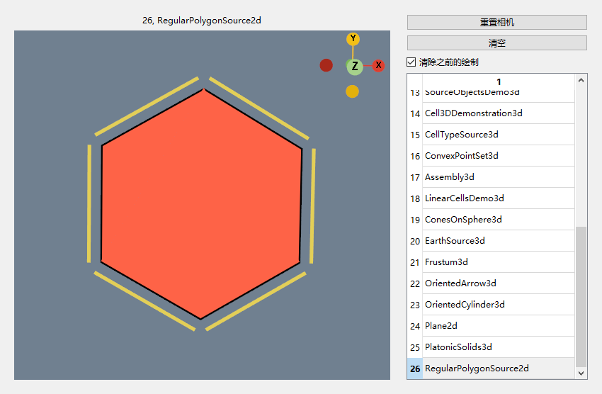
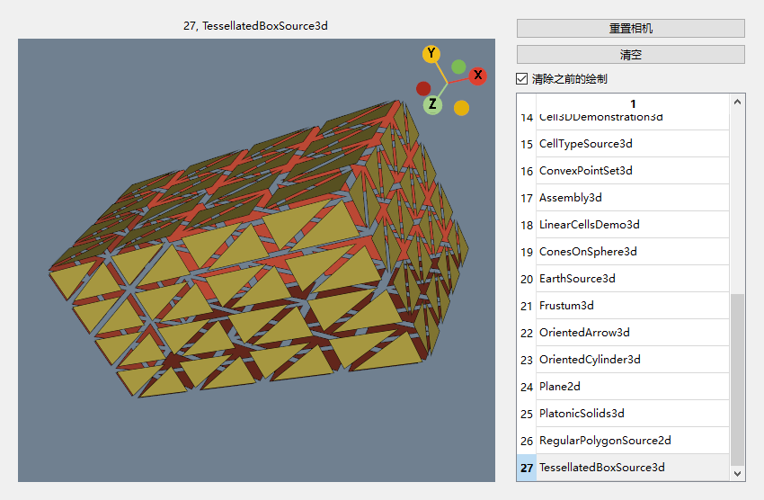
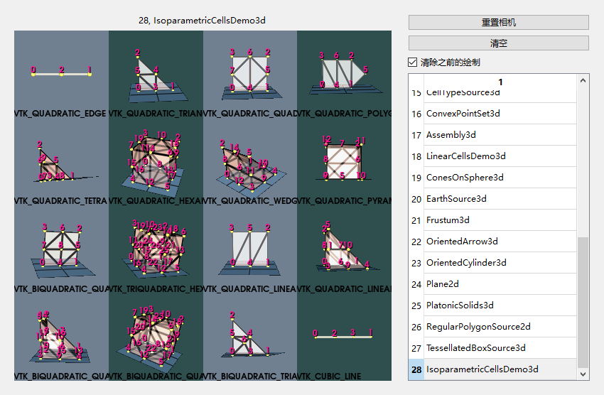
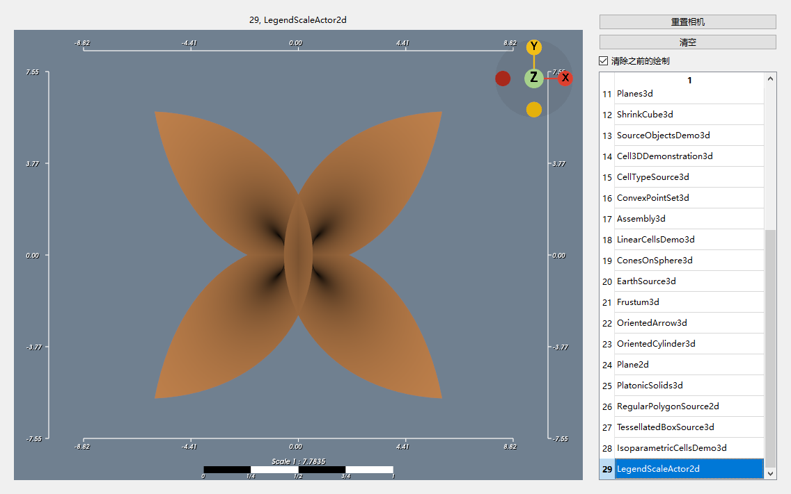
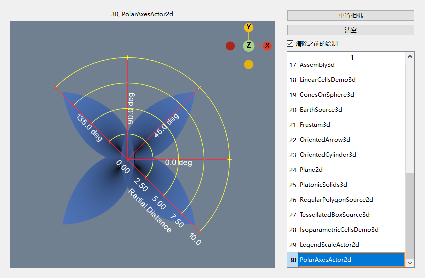
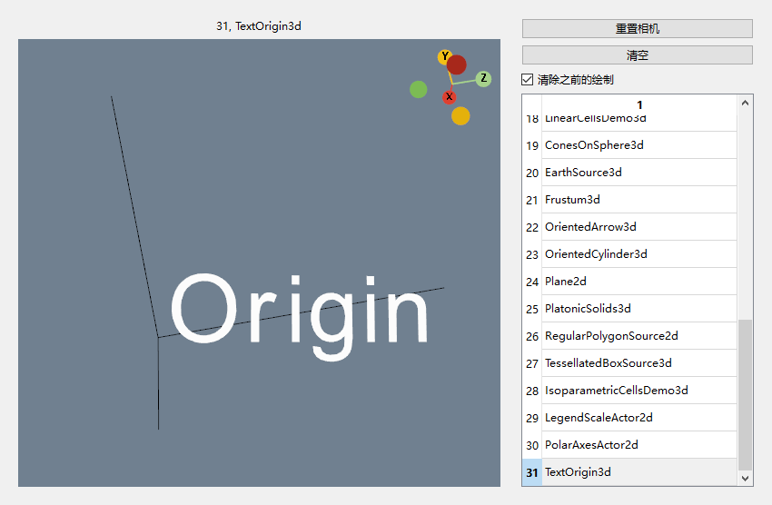
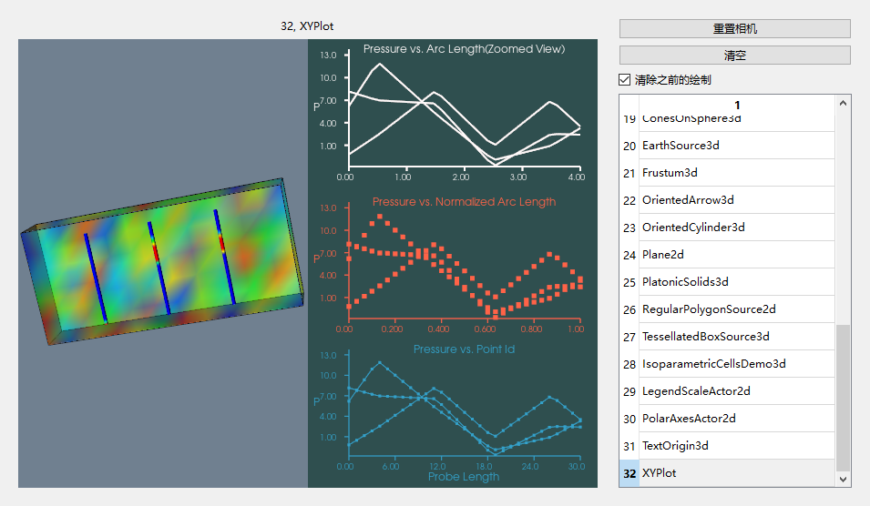
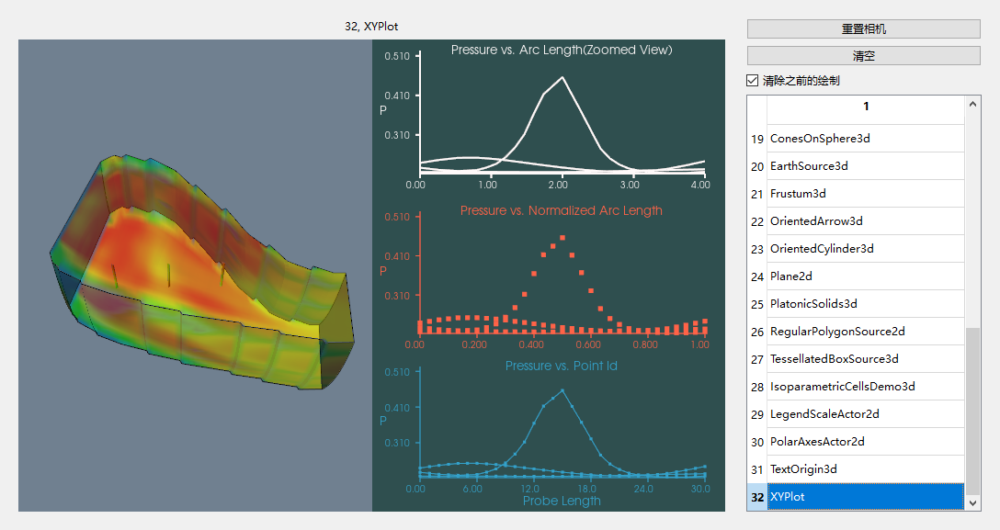
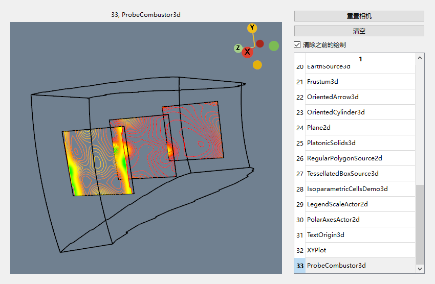
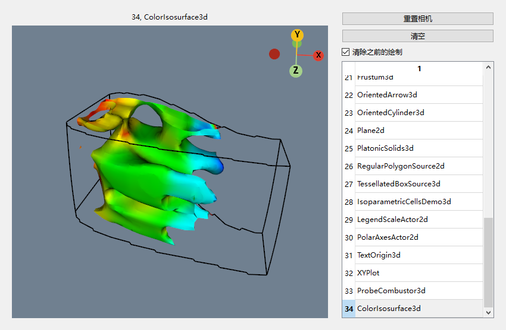

# Tip

- [26, RegularPolygonSource2d](#26-regularpolygonsource2d)
- [27, TessellatedBoxSource3d](#27-tessellatedboxsource3d)
- [28, IsoparametricCellsDemo3d](#28-IsoparametricCellsDemo3d)
- [29, LegendScaleActor2d](#29-LegendScaleActor2d)
- [30, PolarAxesActor2d](#30-PolarAxesActor2d)
- [31, TextOrigin3d](#31-TextOrigin3d)
- [32, XYPlot](#32-XYPlot)
- [33, ProbeCombustor3d](#33-ProbeCombustor3d)
- [34, ColorIsosurface3d](#34-ColorIsosurface3d)
# 26, RegularPolygonSource2d

[回到顶部](#tip)



# 27, TessellatedBoxSource3d

[回到顶部](#tip)



# 28, IsoparametricCellsDemo3d

[回到顶部](#tip)

[learn](./examples/readme_vtkNonLinearCell.md)



# 29, LegendScaleActor2d

[回到顶部](#tip)



# 30, PolarAxesActor2d

[回到顶部](#tip)

```c++
  auto polar_actor = vtkSmartPointer<vtkPolarAxesActor>::New();
  polar_actor->SetCamera(renderer->GetActiveCamera());
```




# 31, TextOrigin3d

[回到顶部](#tip)

```c++
auto text_actor = vtkSmartPointer<vtkFollower>::New();
text_actor->SetCamera(renderer->GetActiveCamera());
```



# 32, XYPlot

[回到顶部](#tip)

[structuredGrid](./examples/readme_32structuredGrid.md)

```c++
        // PositionCoordinate → 定义 左下角（起点）。
        // Position2Coordinate → 定义 尺寸/右上角（终点）。
        // x = 1 → 宽度占据整个窗口宽度（从左到右）。
        // y = 0.33 → 高度 = 窗口的 33%。
        // z = 0 → 无关。
        // 坐标是归一化的 [0,1]（相对窗口大小）。
        xyplot->GetPositionCoordinate()->SetValue(0, y_pos[i], 0);// 位置坐标(归一化)
        xyplot->GetPosition2Coordinate()->SetValue(1, .33, 0);// 宽度, 高度
```



使用官方data文件,而不是假数据



# 33, ProbeCombustor3d

[回到顶部](#tip)



# 34, ColorIsosurface3d

[回到顶部](#tip)

[PLOT3D](./examples/readme_33PLOT3D.md) 

