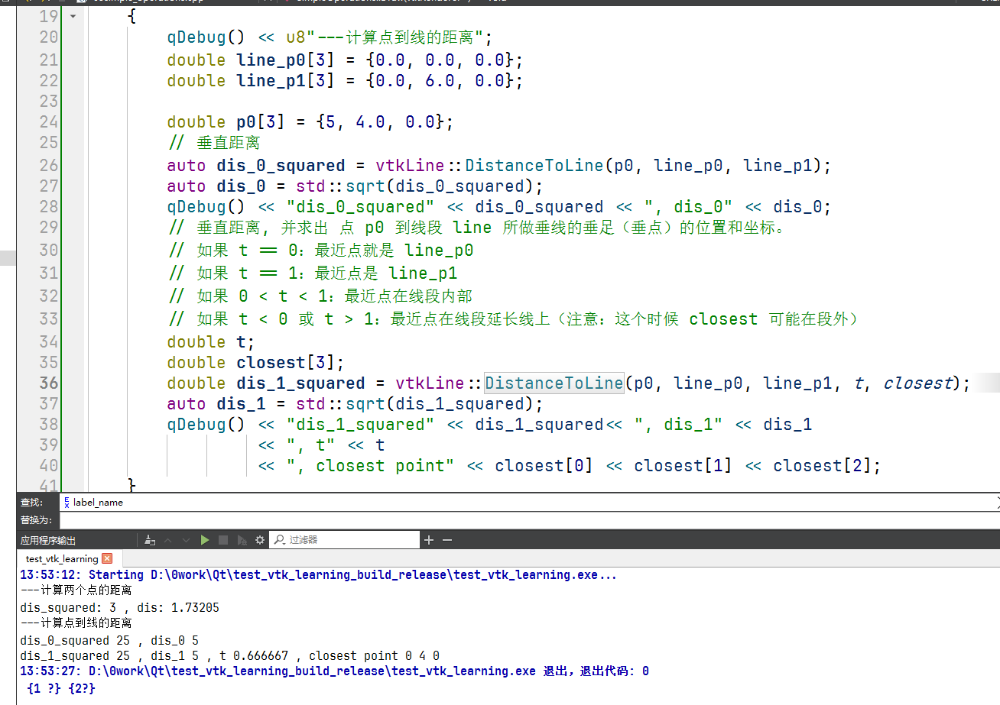
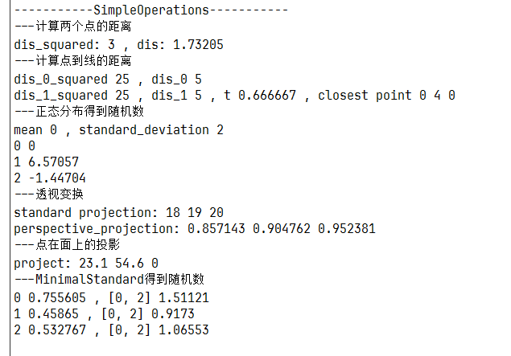
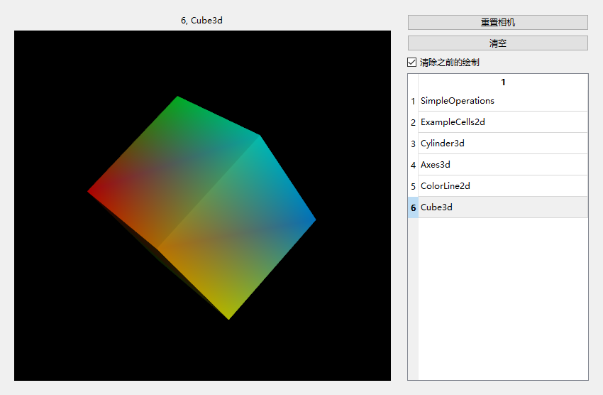

[TOC]

# 1, cells.h(ExampleCells2d)

显示10*10的单元格

# 2, helloworld.h(HelloWorld3d)

 cylinder->SetResolution(6);

根据resolution绘制多个顶点

# 3, SimpleOperations

一些计算,没有图像,在输出查看,具体看代码

# 4, Axes3d

# 5, ColorLine2d

# 6, Cube3d

把sample op移到第一个了,免得不小心点到

